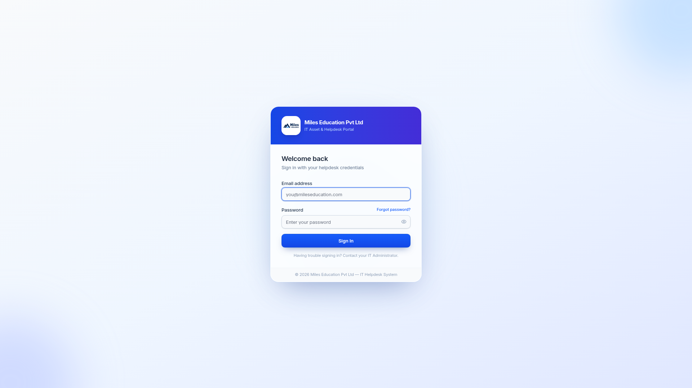
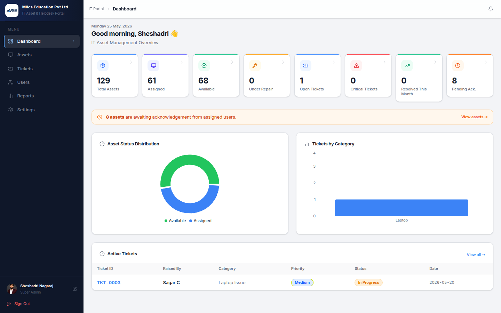
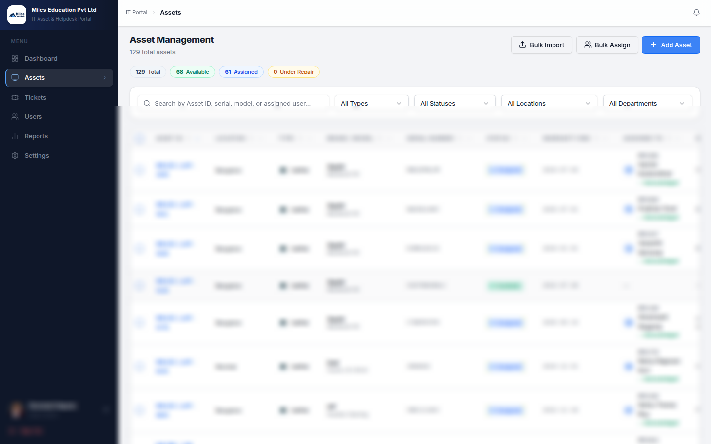
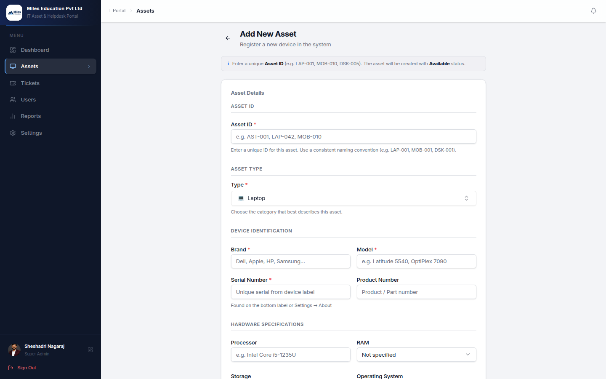
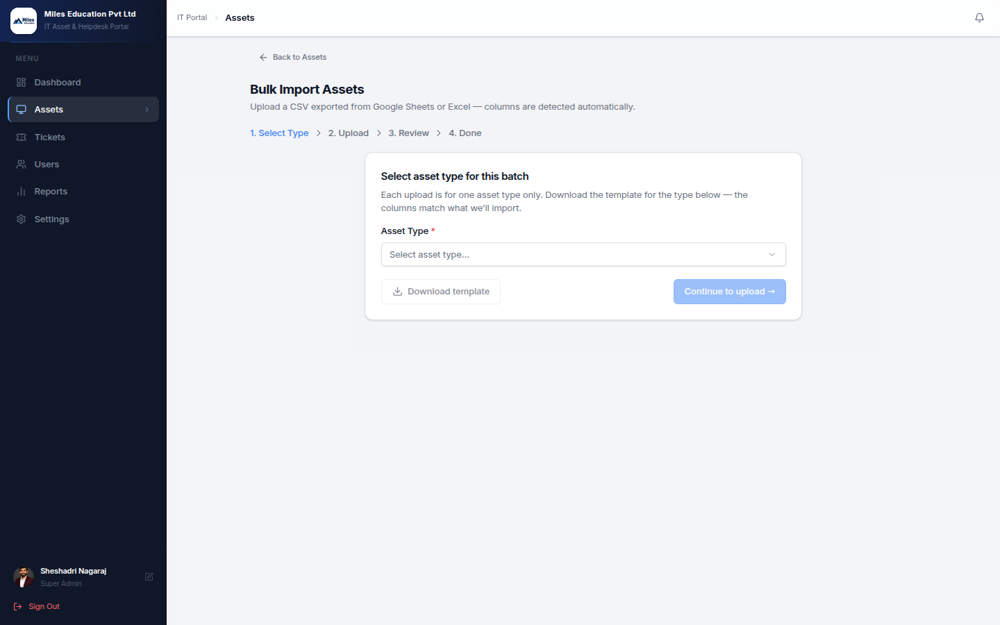
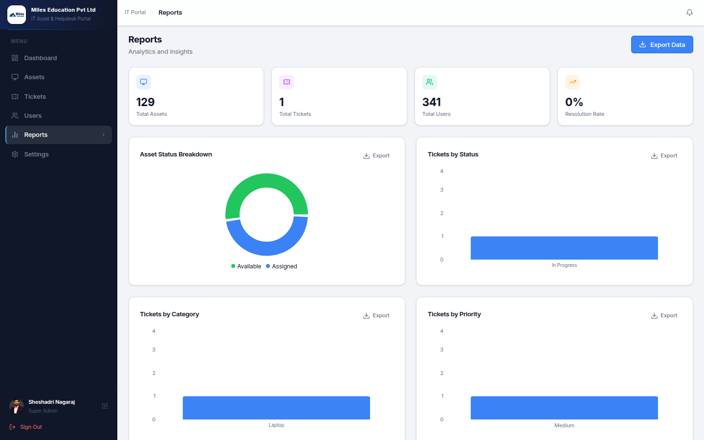
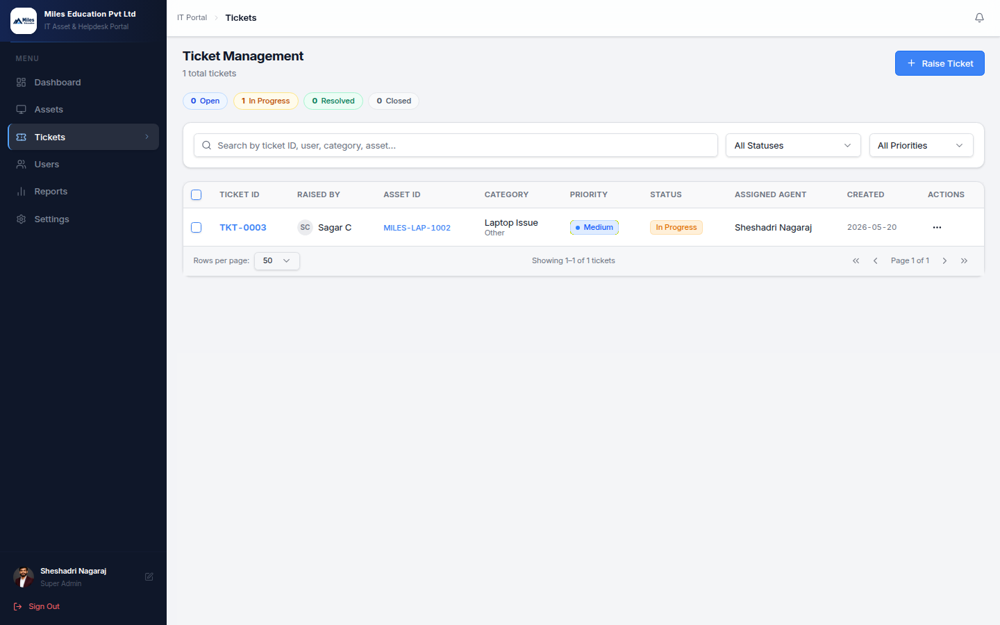
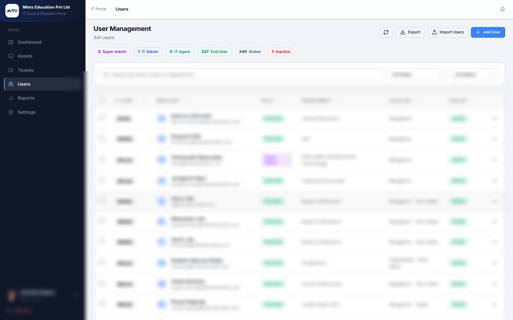

<div align="center">

# 🖥️ IT-Asset-Hub

### *One source of truth for every laptop, license, and ticket at Miles Education.*

**Built for [Miles Education Pvt Ltd](https://www.mileseducation.com)** — a modern, full-stack IT Asset Management & Helpdesk System that helps the Miles IT team track hardware, software licenses, employee allocations, and support tickets — end to end.

[](https://react.dev)
[](https://nextjs.org)
[](https://tailwindcss.com)
[](https://www.djangoproject.com)
[](https://www.django-rest-framework.org)
[](https://www.postgresql.org)
[](https://jwt.io)
[](https://www.docker.com)
[](https://nginx.org)
[](#-license)
[](https://www.mileseducation.com)
[](https://it-asset-hub-a7rf.onrender.com)

[🌐 Live Portal](https://it-asset-hub-a7rf.onrender.com) · [📸 Screenshots](#-screenshots) · [🚀 Quick Start](#-installation-steps) · [📡 API Docs](#-api-endpoints)

`Internal tool · Miles Education Pvt Ltd · Bengaluru, India 🇮🇳`

</div>

---

## 📑 Table of Contents

1. [Why This Project?](#-why-this-project)
2. [Features](#-features)
3. [Tech Stack](#-tech-stack)
4. [Architecture Overview](#-architecture-overview)
5. [Folder Structure](#-folder-structure)
6. [Installation Steps](#-installation-steps)
7. [Environment Variables](#-environment-variables)
8. [API Endpoints](#-api-endpoints)
9. [Authentication Flow](#-authentication-flow)
10. [Role-Based Access](#-role-based-access)
11. [Asset Lifecycle Workflow](#-asset-lifecycle-workflow)
12. [Screenshots](#-screenshots)
13. [Deployment](#-deployment)
14. [Troubleshooting](#-troubleshooting)
15. [Future Enhancements](#-future-enhancements)
16. [Contributing Guidelines](#-contributing-guidelines)
17. [License](#-license)
18. [Contact](#-contact)

---

## 💡 Why This Project?

Before IT-Asset-Hub, the Miles Education IT team — like most growing companies — was juggling assets across **Excel sheets, WhatsApp threads, and email approvals**.
That breaks down fast at 100+ employees: lost devices, expired warranties, untracked licenses, no audit trail.

**IT-Asset-Hub** was purpose-built for Miles Education to solve this with:

- 🎯 A single, searchable inventory for **22 asset categories** (laptops, monitors, mobiles, peripherals, network gear, fixed assets)
- 🔐 **Role-based access** so admins, helpdesk agents, and employees each see exactly what they need
- 📝 A built-in **helpdesk** that links every ticket to a real asset
- 📊 **Real-time reports** with one-click CSV / XLSX exports for finance & audit
- 📨 Automated **assignment emails** with employee acknowledgement

> Deployed to production at Miles Education and actively managing the company's IT inventory across every office. Also serves as a portfolio-grade showcase of modern full-stack engineering — REST API design, JWT auth, role-based authorization, containerized deployment, and clean React UX.

---

## ✨ Features

### 🖥️ Asset Management
- ✅ **22 asset categories** grouped into Main Devices · Accessories · Fixed Assets
- ✅ Auto-generated asset IDs (`MILES-LAP-001`, `MILES-MOB-042`, …)
- ✅ Full lifecycle tracking: *Available → Assigned → Under Repair → Retired / Lost*
- ✅ Searchable, filterable inventory with photo uploads
- ✅ Warranty + purchase-date tracking with expiry alerts

### 👥 Employee Allocations
- ✅ One-click assign / un-assign with handover notes
- ✅ Bulk assignment workflow
- ✅ Email notification + in-app acknowledgement by employee
- ✅ Complete audit trail of every assignment

### 📥 Bulk Import
- ✅ Per-type CSV templates for all 22 categories
- ✅ Smart column detection (handles Google Sheets & Excel exports)
- ✅ Per-row validation with errors shown **before** import
- ✅ Failed-row diagnostics surfaced on the Done screen

### 🎫 Helpdesk Tickets
- ✅ Raise tickets linked to assets or stand-alone
- ✅ Priorities, categories, SLA timestamps, comment threads
- ✅ Auto-assign agents by category

### 📊 Reports & Analytics
- ✅ Assets by Category (donut) + Assets by Type (bar) for all 22 types
- ✅ Per-category CSV exports
- ✅ Full XLSX summary across 7 sheets (Assets, Tickets, Users, By Type, By Status, By Category, By Department)
- ✅ 26-column rich CSV (processor, RAM, OS, IMEI, vendor, invoice, e-code, …)

### 🔐 Security
- ✅ JWT-based auth (access + refresh tokens)
- ✅ Role-based access control (RBAC)
- ✅ CSP / X-Frame-Options security headers
- ✅ Audit log for every sensitive operation

---

## 🧰 Tech Stack

| Layer            | Technology                                      |
|------------------|-------------------------------------------------|
| **Frontend**     | React 18, Next.js 14, Tailwind CSS, shadcn/ui   |
| **State / Data** | TanStack Query, React Context, Axios            |
| **Backend**      | Django 5, Django REST Framework 3.15            |
| **Database**     | PostgreSQL 16                                   |
| **Auth**         | JWT (Access + Refresh, rotation enabled)        |
| **Async**        | Celery + Redis (email & report generation)      |
| **Storage**      | S3-compatible object storage (asset photos)     |
| **DevOps**       | Docker, Docker Compose, Nginx reverse proxy     |
| **CI / CD**      | GitHub Actions                                  |
| **Monitoring**   | Sentry (optional), structured JSON logs         |

---

## 🏗️ Architecture Overview

```
                          ┌──────────────────────────┐
                          │       End Users          │
                          │  (Admin / IT / Employee) │
                          └────────────┬─────────────┘
                                       │ HTTPS
                                       ▼
                          ┌──────────────────────────┐
                          │     Nginx (TLS, gzip)    │
                          │  Static + reverse proxy  │
                          └────────────┬─────────────┘
                                       │
                ┌──────────────────────┴──────────────────────┐
                ▼                                             ▼
  ┌─────────────────────────────┐               ┌─────────────────────────────┐
  │  Next.js / React Frontend   │ ──REST/JWT──▶ │  Django + DRF API Server    │
  │  (SSR pages + CSR app)      │               │  (asset / user / ticket)    │
  └─────────────────────────────┘               └──────────────┬──────────────┘
                                                                │
                          ┌─────────────────────────────────────┼─────────────────────────┐
                          ▼                                     ▼                         ▼
              ┌────────────────────┐              ┌────────────────────┐    ┌────────────────────┐
              │   PostgreSQL 16    │              │   Redis + Celery   │    │   Object Storage   │
              │  (assets, users,   │              │ (emails, reports,  │    │  (asset photos,    │
              │   tickets, audit)  │              │  scheduled jobs)   │    │   invoices)        │
              └────────────────────┘              └────────────────────┘    └────────────────────┘
```

**Design principles**

- **Contract-first API** — OpenAPI 3.1 spec generates typed clients & docs
- **Stateless backend** — horizontal scale via container replicas behind Nginx
- **Background jobs** — long-running work (XLSX exports, emails) handed to Celery
- **Defense in depth** — JWT + RBAC + row-level checks + audit log

---

## 📁 Folder Structure

```
IT-Asset-Hub/
├── frontend/                 # Next.js + React + Tailwind
│   ├── app/                  # App-router pages (dashboard, assets, tickets, reports)
│   ├── components/           # Shared UI components (shadcn/ui)
│   ├── lib/                  # API client, hooks, utils
│   ├── public/               # Static assets, favicons
│   └── next.config.js
│
├── backend/                  # Django + DRF
│   ├── config/               # settings, urls, wsgi/asgi
│   ├── apps/
│   │   ├── accounts/         # User, Profile, JWT views, RBAC
│   │   ├── assets/           # Asset CRUD, assignment, lifecycle
│   │   ├── tickets/          # Helpdesk ticketing
│   │   ├── reports/          # CSV / XLSX exports
│   │   └── audit/            # Audit log middleware + model
│   ├── manage.py
│   └── requirements.txt
│
├── docker/
│   ├── nginx.conf            # TLS termination, gzip, static caching
│   ├── Dockerfile.frontend
│   └── Dockerfile.backend
│
├── docs/
│   ├── screenshots/          # README screenshots
│   └── architecture.md
│
├── .github/workflows/        # CI: lint, test, build, deploy
├── docker-compose.yml
├── .env.example
└── README.md
```

---

## 🚀 Installation Steps

### Prerequisites
- 🐳 Docker 24+ and Docker Compose v2
- 📦 Node 20+ (for local frontend dev)
- 🐍 Python 3.12+ (for local backend dev)
- 🐘 PostgreSQL 16 (if running outside Docker)

### Option A — One command via Docker (recommended)

```bash
# 1. Clone
git clone https://github.com/sheshadrin-web/IT-Asset-Hub.git
cd IT-Asset-Hub

# 2. Copy env template and fill in values
cp .env.example .env

# 3. Bring everything up
docker compose up -d --build

# 4. Run initial migrations & create superuser
docker compose exec backend python manage.py migrate
docker compose exec backend python manage.py createsuperuser

# 5. Visit
#    Frontend → http://localhost
#    API      → http://localhost/api
#    Admin    → http://localhost/admin
```

### Option B — Local dev (without Docker)

```bash
# Backend
cd backend
python -m venv .venv && source .venv/bin/activate
pip install -r requirements.txt
python manage.py migrate
python manage.py runserver 8000

# Frontend (new terminal)
cd frontend
npm install
npm run dev          # http://localhost:3000
```

---

## 🔐 Environment Variables

Copy `.env.example` → `.env` and fill in your values.

### `.env.example`

```bash
# ── Django ─────────────────────────────────────────────────────────────
DJANGO_SECRET_KEY=change-me-to-a-long-random-string
DJANGO_DEBUG=False
DJANGO_ALLOWED_HOSTS=localhost,127.0.0.1,it-asset-hub.example.com

# ── PostgreSQL ─────────────────────────────────────────────────────────
POSTGRES_DB=itassethub
POSTGRES_USER=itassethub
POSTGRES_PASSWORD=super-secret-password
POSTGRES_HOST=db
POSTGRES_PORT=5432

# ── JWT ────────────────────────────────────────────────────────────────
JWT_ACCESS_LIFETIME_MIN=15
JWT_REFRESH_LIFETIME_DAYS=7
JWT_ROTATE_REFRESH=True

# ── Email (SMTP) ───────────────────────────────────────────────────────
EMAIL_HOST=smtp.gmail.com
EMAIL_PORT=587
EMAIL_HOST_USER=it@yourcompany.com
EMAIL_HOST_PASSWORD=your-16-char-app-password
DEFAULT_FROM_EMAIL="IT Helpdesk <it@yourcompany.com>"

# ── Redis / Celery ─────────────────────────────────────────────────────
REDIS_URL=redis://redis:6379/0
CELERY_BROKER_URL=redis://redis:6379/1

# ── Object Storage (S3 / R2 / MinIO) ───────────────────────────────────
AWS_S3_ENDPOINT_URL=https://s3.amazonaws.com
AWS_ACCESS_KEY_ID=your-access-key
AWS_SECRET_ACCESS_KEY=your-secret-key
AWS_STORAGE_BUCKET_NAME=it-asset-hub-photos

# ── Frontend (Next.js) ─────────────────────────────────────────────────
NEXT_PUBLIC_API_BASE_URL=http://localhost/api
NEXT_PUBLIC_APP_NAME="IT Asset Hub"
```

> ⚠️ **Never commit `.env`** — it's already in `.gitignore`. Use a secret manager (Vault, AWS SM, GitHub Encrypted Secrets) in production.

---

## 📡 API Endpoints

All endpoints are prefixed with `/api/v1` and (except auth) require `Authorization: Bearer <access_token>`.

### 🔑 Auth

| Method | Endpoint                  | Description                          |
|--------|---------------------------|--------------------------------------|
| POST   | `/auth/login/`            | Get access + refresh tokens          |
| POST   | `/auth/refresh/`          | Rotate access token                  |
| POST   | `/auth/logout/`           | Blacklist refresh token              |
| GET    | `/auth/me/`               | Current user + role                  |

### 🖥️ Assets

| Method | Endpoint                          | Description                          |
|--------|-----------------------------------|--------------------------------------|
| GET    | `/assets/`                        | List + filter + paginate             |
| POST   | `/assets/`                        | Create asset (IT Admin+)             |
| GET    | `/assets/{id}/`                   | Asset detail                         |
| PATCH  | `/assets/{id}/`                   | Update asset                         |
| DELETE | `/assets/{id}/`                   | Soft-delete (Super Admin)            |
| POST   | `/assets/{id}/assign/`            | Assign to user                       |
| POST   | `/assets/{id}/return/`            | Return asset                         |
| POST   | `/assets/{id}/acknowledge/`       | Employee acknowledges receipt        |
| POST   | `/assets/bulk-import/`            | CSV bulk import                      |
| GET    | `/assets/export/?format=csv|xlsx` | Export inventory                     |

### 🎫 Tickets

| Method | Endpoint                       | Description                          |
|--------|--------------------------------|--------------------------------------|
| GET    | `/tickets/`                    | List tickets (filtered by role)      |
| POST   | `/tickets/`                    | Raise new ticket                     |
| GET    | `/tickets/{id}/`               | Ticket detail + comments             |
| POST   | `/tickets/{id}/comments/`      | Add comment                          |
| PATCH  | `/tickets/{id}/status/`        | Change status                        |

### 👤 Users (Admin only)

| Method | Endpoint            | Description                |
|--------|---------------------|----------------------------|
| GET    | `/users/`           | List users                 |
| POST   | `/users/`           | Invite new user            |
| PATCH  | `/users/{id}/role/` | Change role                |
| DELETE | `/users/{id}/`      | Deactivate user            |

### 📊 Reports

| Method | Endpoint                            | Description             |
|--------|-------------------------------------|-------------------------|
| GET    | `/reports/summary/`                 | Dashboard KPIs          |
| GET    | `/reports/by-category/`             | Counts per category     |
| GET    | `/reports/by-type/`                 | Counts per type         |
| GET    | `/reports/full.xlsx`                | Full multi-sheet XLSX   |

### Sample Response — `GET /api/v1/assets/MILES-LAP-001/`

```json
{
  "id": "MILES-LAP-001",
  "asset_type": "Laptop",
  "brand": "Dell",
  "model": "Latitude 5430",
  "serial_number": "5CD2345XYZ",
  "processor": "Intel i7-1265U",
  "ram": "16 GB",
  "storage": "512 GB SSD",
  "operating_system": "Windows 11 Pro",
  "status": "Assigned",
  "assigned_to": {
    "id": "f1b2…",
    "full_name": "Sheshadri Nagaraj",
    "email": "sheshadri.n@mileseducation.com",
    "ecode": "MPE1042",
    "department": "Engineering"
  },
  "assigned_at": "2026-04-12T09:14:22Z",
  "acknowledged": true,
  "acknowledged_at": "2026-04-12T09:31:08Z",
  "purchase_date": "2024-03-15",
  "warranty_end_date": "2027-03-14",
  "vendor": "Dell Direct",
  "location": "Bengaluru",
  "photos": [
    "https://cdn.example.com/assets/MILES-LAP-001/front.jpg"
  ]
}
```

### Sample Response — `POST /api/v1/auth/login/`

```json
{
  "access":  "eyJhbGciOiJIUzI1NiIsInR5cCI6IkpXVCJ9...",
  "refresh": "eyJhbGciOiJIUzI1NiIsInR5cCI6IkpXVCJ9...",
  "user": {
    "id": "f1b2…",
    "email": "admin@yourcompany.com",
    "role": "SUPER_ADMIN",
    "full_name": "Admin User"
  }
}
```

### Sample Response — `GET /api/v1/reports/summary/`

```json
{
  "total_assets": 128,
  "available": 17,
  "assigned": 102,
  "under_repair": 6,
  "open_tickets": 4,
  "by_category": {
    "Main Devices": 128,
    "Accessories":  0,
    "Fixed Assets": 0
  }
}
```

---

## 🔐 Authentication Flow

```
┌────────┐  1. POST /auth/login          ┌─────────────┐
│ Client │ ────────────────────────────▶ │   Backend   │
│        │ ◀──────────────────────────── │             │
│        │  2. { access, refresh, user } └─────────────┘
│        │
│        │  3. Store access (memory) + refresh (httpOnly cookie / secure store)
│        │
│        │  4. Every request:
│        │     Authorization: Bearer <access>
│        │ ────────────────────────────▶ ┌─────────────┐
│        │                               │  Protected  │
│        │ ◀──────────────────────────── │   resource  │
│        │                               └─────────────┘
│        │
│        │  5. On 401:  POST /auth/refresh  →  new access (+ rotated refresh)
│        │  6. Retry original request transparently
└────────┘
```

- **Access tokens** are short-lived (15 min default)
- **Refresh tokens** are rotated on every use and blacklisted on logout
- All sensitive endpoints additionally check **role + object-level permissions**

---

## 👥 Role-Based Access

| Role              | Assets                       | Tickets                       | Users          | Reports         |
|-------------------|------------------------------|-------------------------------|----------------|-----------------|
| 🟣 **Super Admin**   | Full CRUD + delete            | Full CRUD                     | Full CRUD      | Full + export   |
| 🔵 **IT Admin**      | Full CRUD, assign, import     | Manage + assign agents        | Read           | Full + export   |
| 🟢 **Helpdesk Agent**| Read + status update          | Work on assigned tickets      | Read           | Read            |
| ⚪ **Employee**      | Read **own** assigned assets  | Raise + comment on own tickets | —              | —               |

RBAC is enforced at three layers:
1. **JWT claim** carries the role
2. **DRF permission class** gates each viewset action
3. **Queryset filter** prevents row-level leakage (`.filter(assigned_to=request.user)`)

---

## 🔄 Asset Lifecycle Workflow

```
   ┌───────────┐   assign    ┌──────────┐   acknowledge   ┌────────────────┐
   │ Available │ ──────────▶ │ Assigned │ ──────────────▶ │ Active (in use)│
   └───────────┘             └──────────┘                 └────────┬───────┘
         ▲                         │                               │
         │ return                  │ report issue                  │
         │                         ▼                               │
         │                  ┌──────────────┐    repair complete    │
         │                  │ Under Repair │ ◀─────────────────────┘
         │                  └──────┬───────┘
         │                         │
         │                         │ irreparable
         │                         ▼
         │                  ┌──────────────┐
         └───── reissue ─── │   Retired    │
                            └──────┬───────┘
                                   │ lost / stolen
                                   ▼
                            ┌──────────────┐
                            │     Lost     │
                            └──────────────┘
```

Every transition writes a row in `asset_assignment_history` with **who, when, why, and notes** — full audit trail for finance & compliance.

---

## 📸 Screenshots

### 🔐 Sign-in


### 🏠 Admin Dashboard
At-a-glance KPIs across all 129 assets, with status distribution, tickets by category, and active ticket queue.


### 🖥️ Asset Management
Searchable, filterable inventory across all asset types with auto-generated asset IDs, assignee, warranty, and acknowledgement status.


### ➕ Add Asset
Full-form asset creation with type-specific fields (processor, RAM, OS, IMEI, vendor, invoice, …).


### 📥 Bulk Import
Per-type CSV templates for all 22 categories with row-level validation.


### 📊 Reports & Analytics
Asset status breakdown, tickets by status / category / priority, with one-click CSV / XLSX export.


### 🎫 Helpdesk Tickets
Ticket queue linked to assets, with priority, status, and assignee tracking.


### 👥 User Management
Manage IT staff, helpdesk agents, and end-users with role-based access control.


---

## 🚀 Deployment

### Docker Compose (single host)

```bash
docker compose -f docker-compose.prod.yml up -d --build
docker compose exec backend python manage.py migrate
docker compose exec backend python manage.py collectstatic --noinput
```

### Nginx (TLS termination snippet)

```nginx
server {
    listen 443 ssl http2;
    server_name it-asset-hub.example.com;

    ssl_certificate     /etc/letsencrypt/live/it-asset-hub.example.com/fullchain.pem;
    ssl_certificate_key /etc/letsencrypt/live/it-asset-hub.example.com/privkey.pem;

    add_header X-Frame-Options "SAMEORIGIN";
    add_header X-Content-Type-Options "nosniff";
    add_header Content-Security-Policy "default-src 'self'; img-src 'self' data: https:;";

    client_max_body_size 25M;

    location /api/  { proxy_pass http://backend:8000; }
    location /admin/{ proxy_pass http://backend:8000; }
    location /     { proxy_pass http://frontend:3000; }
}
```

### CI / CD (GitHub Actions, summary)

```yaml
name: deploy
on: { push: { branches: [main] } }
jobs:
  build-and-deploy:
    runs-on: ubuntu-latest
    steps:
      - uses: actions/checkout@v4
      - run: docker compose build
      - run: docker compose push
      - name: SSH deploy
        uses: appleboy/ssh-action@v1
        with:
          host:     ${{ secrets.DEPLOY_HOST }}
          username: ${{ secrets.DEPLOY_USER }}
          key:      ${{ secrets.DEPLOY_KEY }}
          script:   cd /srv/it-asset-hub && docker compose pull && docker compose up -d
```

---

## 🛠️ Troubleshooting

| Symptom                                            | Likely cause                                          | Fix                                                                              |
|----------------------------------------------------|-------------------------------------------------------|----------------------------------------------------------------------------------|
| `401 Unauthorized` on every request                | Access token expired / clock skew                     | Trigger refresh flow; check container clock (`ntpd`)                             |
| `CSRF verification failed` in admin                | Missing `CSRF_TRUSTED_ORIGINS`                        | Add your domain to `CSRF_TRUSTED_ORIGINS` in settings                            |
| `connection refused` to Postgres                   | DB not up yet / wrong host                            | `docker compose logs db`; ensure `POSTGRES_HOST=db` matches compose service name |
| Bulk import fails with `null value in column ...`  | CSV column missing for NOT NULL field                 | Use the per-type template; blank cells are auto-converted to `""`                |
| Emails not sending                                 | Gmail blocked the password / 2FA off                  | Generate an **App Password** and use that instead of your account password       |
| Static files 404 in production                     | `collectstatic` not run                               | `docker compose exec backend python manage.py collectstatic --noinput`           |
| Nginx returns `413 Request Entity Too Large`       | Photo upload bigger than default 1 MB                 | Add `client_max_body_size 25M;` (see Nginx snippet above)                        |
| Frontend can't reach API in Docker                 | Hard-coded `localhost` in `NEXT_PUBLIC_API_BASE_URL`  | Use the public domain or compose service name                                    |

---

## 🚧 Future Enhancements

- [ ] 📱 **Mobile app** (React Native / Expo) for on-the-go asset scanning
- [ ] 📷 **QR / barcode** generation per asset + camera scan to look up
- [ ] 🧾 **Software license** tracking with seat-count & renewal alerts
- [ ] 🤖 **AI ticket triage** — auto-classify category & suggested resolution
- [ ] 📅 **Procurement workflow** — purchase requests → approvals → PO → GRN
- [ ] 🔔 **Slack / MS Teams** notifications
- [ ] 🌍 **Multi-tenant** mode for MSPs managing multiple clients
- [ ] 🌓 **Dark mode** polish + accessibility (WCAG 2.2 AA)
- [ ] 📈 **Predictive analytics** — warranty expiry forecasting, refresh planning
- [ ] 🔌 **SSO** (Google Workspace / Microsoft Entra ID / Okta)

---

## 🤝 Contributing Guidelines

Contributions are welcome and appreciated! 🎉

1. **Fork** the repo and create your branch from `main`
   ```bash
   git checkout -b feat/amazing-feature
   ```
2. **Code style**
   - Backend: `black`, `ruff`, `isort` — run `make lint`
   - Frontend: `eslint`, `prettier` — run `npm run lint`
3. **Write tests** for new features (pytest / vitest)
4. **Commit messages** follow [Conventional Commits](https://www.conventionalcommits.org/)
   ```
   feat(assets): add QR code generation
   fix(auth): rotate refresh token on logout
   docs(readme): add deployment section
   ```
5. **Open a Pull Request** with a clear description, screenshots if UI, and a checklist
6. CI must be green before review

### Local checks before pushing

```bash
make lint test           # backend
npm run lint && npm test # frontend
```

---

## 📄 License

This project is **proprietary software** built for and owned by **Miles Education Pvt Ltd**.
The source is published for internal collaboration and portfolio reference only.

```
Copyright © 2026 Miles Education Pvt Ltd. All rights reserved.

This software is the confidential and proprietary information of
Miles Education Pvt Ltd ("Confidential Information"). You shall not
disclose such Confidential Information and shall use it only in
accordance with the terms of the agreement you entered into with
Miles Education.
```

For commercial licensing or reuse outside Miles Education, please contact the maintainer below.

---

## 📬 Contact

<div align="center">

**Sheshadri Nagaraj**
IT Asset Management & Helpdesk Lead
**Miles Education Pvt Ltd** · [mileseducation.com](https://www.mileseducation.com)

[](mailto:sheshadri.n@mileseducation.com)
[](https://github.com/sheshadrin-web)
[](https://github.com/sheshadrin-web/IT-Asset-Hub)
[](https://it-asset-hub-a7rf.onrender.com)

⭐ If this project helped you, please consider giving it a **star** — it really helps!

</div>
